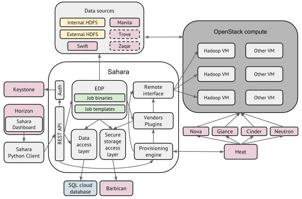

# Openstack Sahara组件和架构简介

## 1.简介

Apache Hadoop是目前被广泛使用的主流大数据处理计算框架，Sahara项目旨在使用用户能够在Openstack平台上便于创建和管理Hadoop以及其他计算框架集群，实现类似AWS的EMR（Amazon Elastic MapReduce service）服务。用户只需要提供简单的参数，如版本信息、集群拓扑、节点硬件信息等，利用Sahara服务能够在数分钟时间内快速地部署Hadoop、Spark、Storm集群。Sahara还支持节点的弹性扩展，能够方便地按需增加或者减少计算节点，实现弹性数据计算服务。它特别适合开发人员或者QA在Openstack平台上快速部署大数据处理计算集群。

它特效包括：

* Openstack的标准组件之一；
* 通过REST API和Dashboard UI界面管理集群；
* 支持多种数据处理计算框架，包括：
	* 多种Hadoop厂商发行版，比如CDH等；
	* Apache Spark和Storm；
	* 可插除的Hadoop安装引擎；
	* 集成厂商的特定管理工具，如Apache Ambari and Cloudera Management Console。
* 支持配置模板。

它和其他Openstack组件交互，如图：

## 2.工作流程

sahara提供两个层次的API，分别为集群管理（cluster provisioning）和任务管理（analytics as a service）。

集群管理工作流包括：

1. 选择Hadoop发行版本；
2. 选择base镜像，base镜像用于生成工作节点，base镜像或者已经预先安装了Hadoop的必要组件，或者提供可插除的可自动快速部署Hadoop的工具。base镜像可以自己制作，也可以直接下载： http://sahara-files.mirantis.com/images/upstream/liberty/
3. 集群配置，包括集群大小、集群拓扑（配置组件角色）和一些附加参数（如堆大小、HDFS冗余份数等）；
4. 创建集群，sahara将自动创建虚拟机、部署和配置数据分析计算框架集群；
5. 集群管理，如增加或者删除节点；
6. 集群销毁，用户不需要时，可以删除集群，释放所有的资源。

任务管理工作流包括：

1. 选择预先定义的数据处理计算框架以及版本；
2. 任务配置：

	* 选择任务类型：pig，hive，java-jar等；
	* 提供任务脚本源或者jar包地址；
	* 选择输入、输出地址。
	
3. 限制集群大小；
4. 执行任务，注意所有底层的集群管理和任务执行流程对用户是完全透明的，当任务执行完后，集群将会自动移除提交的任务；
5. 获取处理结果（如Swift）。

## 3.用户视角
通过sahara管理集群，用户主要需要操作以下三个实体对象：Node Group Templates, Cluster Templates and Clusters:

* Node Group Templates:设置单一节点的模板，包括启动虚拟机的flavor、安全组、可用域、镜像等，以及配置Hadoop角色，比如namenode、secondarynamenode、resourcemanager。比如我们可以创建Master节点模板，flavor为m1.large，启动镜像为sahara-mitaka-vanilla-hadoop-2.7.1-ubuntu-14.04，配置namenode、resourcemanager、secondarynamenode角色，创建Slave节点模板，flavor为m1.large,镜像为sahara-mitaka-vanilla-hadoop-2.7.1-ubuntu-14.04，配置角色为datanode、nodemanager等。
* Cluster Templates：即集群拓扑，包括节点数量（如Master数量、Slave数量）、Hadoop参数配置，比如HDFS配置、YARN配置等。
* Clusters：集群管理，包括集群扩容、集群启动、集群删除等。

sahara允许用户自由组合节点角色，比如Job Tracker和NameNode可以运作在同一个虚拟机中，也可以分离在不同的虚拟机中。但是sahara会检查集群是否有效，比如不允许创建只有一系列DataNode节点但不存在NameNode节点的集群。

sahara遵从Openstack的通用访问策略，即支持租户、用户等权限管理。

## 4.集成对象存储服务

sahara支持从Swift对象存储读取数据和保存结果数据，集成文档参考http://docs.openstack.org/developer/sahara/userdoc/hadoop-swift.html。

## 5.集群监控

除了支持Hadoop厂商提供的监控工具，sahara还提供可插除集成其他外部监控工具，比如Nagios Zabbix，这些外部工具完全和集群分离，可以单独部署在一个单独的虚拟机，因此可以同时监控多个集群。

## 6.架构
sahara架构如图所示：

主要包括以下几个组件：

* Auth component（认证组件） - 负责和认证服务交互完成客户认证。
* DAL - 数据访问层, 负责为持久化数据提供数据库访问接口。
* Secure Storage Access Layer（安全存储访问层） - 保存用户认证信息，比如用户密码、密钥等。
* Provisioning Engine - 该组件负责和Openstack其他组件交互，比如Nova组件、Heat组件、Cinder组件以及Glance组件等。
* Vendor Plugins（厂商插件） - 负责配置和启动计算框架，不同的计算框架启动方式和配置都不一样，因此提供插件机制，使sahara同时可支持多种计算框架。已经完成集成的插件包括Apache Ambari和Cloudera Management Console等。
* EDP - Elastic Data Processing，负责调度和管理任务。
* REST API - 通过REST HTTP API接口暴露sahara管理功能。
* Python Sahara Client - sahara命令行管理工具。
* Sahara pages - Openstack Dashboard显示页面。

## 参考

1. sahara开发文档：http://docs.openstack.org/developer/sahara
