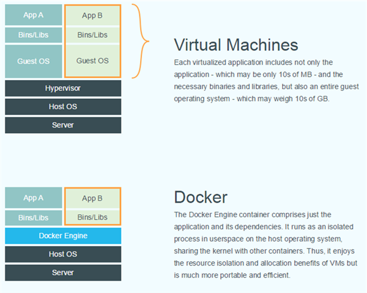

## 操作系统

 我们知道:
<div style='color:red;font-size:20px;'>
完整的操作系统=内核+apps
</div>
内核负责管理底层硬件资源，包括CPU、内存、磁盘等等，并向上为apps提供系统调用接口，上层apps应用必须通过系统调用方式使用硬件资源，通常并不能直接访问资源。apps就是用户直接接触的应用，比如命令行工具、图形界面工具等（linux的图形界面也是作为可选应用之一，而不像windows是集成到内核中的）。同一个内核加上不同的apps，就构成了不同的操作系统发行版，比如ubuntu、rethat、android（当然内核通常针对不同的发行版会有修改）等等。因此我们可以认为，不同的操作系统发行版本其实就是由应用apps构成的环境的差别（比如默认安装的软件以及链接库、软件包管理、图形界面应用等等）。我们把所有这些apps环境打成一个包，就可以称之为镜像。问题来了，假如我们同时有多个apps环境，能否在同一个内核上运行呢？因为操作系统只负责提供服务，而并不管为谁服务，因此同一个内核之上可以同时运行多个apps环境。比如假设我们现在有ubuntu和fedora的apps环境，即两个发行版镜像，分别位于`/home/int32bit/ubuntu`和`/home/int32bit/fedora`，我们最简单的方式，采用`chroot`工具即可快速切换到指定的应用环境中，相当于同时有多个apps环境在运行。

## 容器技术

我们以上通过chroot方式，好像就已经实现了容器的功能，但其实容器并没有那么简单，工作其实还差得远。首先要作为云资源管理还必须满足：

### 1.资源隔离
因为云计算本质就是集中资源再分配（社会主义），再分配过程就是资源的逻辑划分，提供资源抽象的实现方式比如我们熟悉的虚拟机等，我们把资源抽象一次划分称为单元。单元必须满足隔离性，包括用户隔离（或者说权限隔离）进程隔离、网络隔离、文件系统隔离等，即单元内部只能感知其内部的资源，而不能感知单元以外的资源（包括宿主资源以及其他单元的资源）。
### 2.资源控制
即为单元分配资源量，能控制单元的资源最大使用量。单元不能使用超过分配的资源量。

当然还包括其他很多条件，本文主要基于这两个基本条件进行研究。

显然满足以上两个条件，虚拟机是一种实现方式，这是因为：

* 隔离毋容置疑，因为不同的虚拟机运行在不同的内核，虚拟机内部是一个独立的隔离环境
* hypervisor能够对虚拟机分配指定的资源

基于虚拟机快速构建应用环境比如`vagrant`等。

但是虚拟机也带来很多问题，比如：

* 镜像臃肿庞大，不仅包括apps，还必须包括一个庞大的内核
* 创建和启动时间开销大，不利于快速构建重组
* 额外资源开销大，部署密度小
* 性能损耗
* ...

有没有其他实现方式能符合以上两个条件呢？容器技术便是另一种实现方式。表面上和我们使用chroot方式相似，即所有的容器实例内部的应用是直接运行在宿主机中，所有实例共享宿主机的内核，而虚拟机实例内部的进程是运行在GuestOS中。由以上原理可知，容器相对于虚拟机有以上好处：

* 镜像体积更小，只包括应用以及所依赖的环境，没有内核。
* 创建和启动快，不需要启动GuestOS，应用启动开销基本就是应用本身启动的时间开销。
* 无GuestOS，无hypervisor，无额外资源开销，资源控制粒度更小，部署密度大。
* 使用的是真实物理资源，因此不存在性能损耗。
* 轻量级
* ...

但如何实现资源隔离和控制呢？

### 1. 隔离性

主要通过内核提供namespace技术实现隔离性，以下参考[酷壳](http://coolshell.cn/articles/17010.html):
>Linux Namespace是Linux提供的一种内核级别环境隔离的方法。不知道你是否还记得很早以前的Unix有一个叫chroot的系统调用（通过修改根目录把用户jail到一个特定目录下），chroot提供了一种简单的隔离模式：chroot内部的文件系统无法访问外部的内容。Linux Namespace在此基础上，提供了对UTS、IPC、mount、PID、network、User等的隔离机制。
>

Linux Namespace 有如下种类，官方文档在这里[《Namespace in Operation》](http://lwn.net/Articles/531114/)

| 分类 |	系统调用参数 | 相关内核版本
|---------|------------------------|----------------------|
|Mount namespaces|	CLONE_NEWNS | Linux 2.4.19
|UTS namespaces | CLONE_NEWUTS|Linux 2.6.19
|IPC namespaces	|CLONE_NEWIPC|Linux 2.6.19
|PID namespaces	|CLONE_NEWPID|	Linux 2.6.24
|Network namespaces|CLONE_NEWNET|始于Linux 2.6.24 完成于 Linux 2.6.29
|User namespaces|CLONE_NEWUSER|始于 Linux 2.6.23 完成于 Linux 3.8)

由上表可知，通过Namespaces技术可以实现隔离性，比如网络隔离，我们可以通过`sudo ip netns ls`查看网络命名空间，通过`ip netns add NAME`增加网络命名等。

### 2.资源控制
内核实现了对进程组的资源控制，即Linux Control Group，简称cgoup，它能为系统中运行进程组根据用户自定义组分配资源。简单来说，可以实现把多个进程合成一个组，然后对这个组的资源进行控制，比如CPU使用时间，内存大小、网络带宽、磁盘读写等，linux把cgroup抽象成一个虚拟文件系统，可以挂载到指定的目录下，ubuntu14.04默认自动挂载在`/sys/fs/cgroup`下，用户也可以手动挂载，比如挂载memory子系统（子系统一类资源的控制，比如cpu、memory，blkio等）到`/mnt`下：

```bash
sudo mount  -t cgroup -o memory  memory /mnt
```
挂载后就能像查看文件一样方便浏览进程组以及资源控制情况，控制组并不是孤立的，而是组织成树状结构构成进程组树，控制组的子节点会继承父节点。下面以memory子系统为例，

```bash
ls /sys/fs/cgroup/memory/
```
输出：

```
cgroup.clone_children  memory.kmem.failcnt                 memory.kmem.tcp.usage_in_bytes   memory.memsw.usage_in_bytes      memory.swappiness
cgroup.event_control   memory.kmem.limit_in_bytes          memory.kmem.usage_in_bytes       memory.move_charge_at_immigrate  memory.usage_in_bytes
cgroup.procs           memory.kmem.max_usage_in_bytes      memory.limit_in_bytes            memory.numa_stat                 memory.use_hierarchy
cgroup.sane_behavior   memory.kmem.slabinfo                memory.max_usage_in_bytes        memory.oom_control               notify_on_release
docker                 memory.kmem.tcp.failcnt             memory.memsw.failcnt             memory.pressure_level            release_agent
memory.failcnt         memory.kmem.tcp.limit_in_bytes      memory.memsw.limit_in_bytes      memory.soft_limit_in_bytes       tasks
memory.force_empty     memory.kmem.tcp.max_usage_in_bytes  memory.memsw.max_usage_in_bytes  memory.stat                      user
```

以上是根控制组的资源限制情况，我们以创建控制内存为4MB的Docker容器为例：

```bash
docker run  -m 4MB -d busybox ping localhost
```

返回id为`0532d4f4af67`，自动会创建以docker实例id为为名的控制组，位于`/sys/fs/cgroup/memory/docker/0532d4f4af67...`，我们查看该目录下的`memory.limit_in_bytes`文件内容为：

```bash
cat memory.limit_in_bytes
4194304
```
即最大的可使用的内存为4MB，正好是我们启动Docker所设定的。

由以上可知，容器实现了资源的隔离性以及控制性。容器的具体实现如LXC、LXD等。

## Docker技术

Docker是PaaS提供商dotCloud开源的一个基于LXC的高级容器引擎，简单说Docker提供了一个能够方便管理容器的工具。使用Docker能够：

* 快速构建基于容器的分布式应用
* 具有容器的所有优点
* 提供原生的资源监控
* ...

Docker与虚拟机原理对比：



由于容器技术很早就有，Docker最核心的创新在于它的镜像管理，因此有人说：

```
Docker = 容器 + Docker镜像
```
Docker镜像的创新之处在于使用了类似层次的文件系统AUFS，简单说就是一个镜像是由多个镜像层层叠加的，从一个base镜像中通过加入一些软件构成一个新层的镜像，依次构成最后的镜像，如图 


[知乎：docker的几点疑问](https://www.zhihu.com/question/25394149/answer/30671258):

> Image的分层，可以想象成photoshop中不同的layer。每一层中包含特定的文件，当container运行时，这些叠加在一起的层就构成了container的运行环境（包括相应的文件，运行库等，不包括内核）。Image通过依赖的关系，来确定整个镜像内到底包含那些文件。之后的版本的docker，会推出squash的功能，把不同的层压缩成为一个，和Photoshop中合并层的感觉差不多。
作者：Honglin Feng
链接：https://www.zhihu.com/question/25394149/answer/30671258
来源：知乎
著作权归作者所有。商业转载请联系作者获得授权，非商业转载请注明出处。
>

这样的好处是：

* 节省存储空间 - 多个镜像共享base image存储
* 节省网络带宽 - 拉取镜像时，只需要拉取本地没有的镜像层，本地已经存在的可以共享，避免多次传输拷贝
* 节省内存空间 - 多个实例可共享base image, 多个实例的进程命中缓存内容的几率大大增加。如果基于某个镜像启动一个虚拟机需要资源k，则启动n个同一个镜像的虚拟机需要占用资源kn，但如果基于某个镜像启动一个Docker容器需要资源k，无论启动多少个实例，资源都是k。
* 维护升级方便 - 相比于 copy-on-write 类型的FS，base-image也是可以挂载为可writeable的，可以通过更新base image而一次性更新其之上的container
* 允许在不更改base-image的同时修改其目录中的文件 - 所有写操作都发生在最上层的writeable层中，这样可以大大增加base image能共享的文件内容。

使用容器技术，带来了很多优点，但同时也存在一些问题：

* 隔离性相对虚拟机弱-由于和宿主机共享内核，带来很大的安全隐患，容易发生逃逸。
* 如果某些应用需要特定的内核特性，使用容器不得不更换宿主机内核。
* ...

更多关于AUFS参考[酷壳:Docker基础技术-AUFS](http://coolshell.cn/articles/17061.html)
## Hyper

上文提到容器也存在问题，并且Docker的核心创新在于镜像管理，即：

```
Docker = 容器 + Docker镜像
```
有人提出把容器替换成最初的hypervisor，即接下来介绍的Hyper，[官方](https://hyper.sh/)定义：

```
Hyper - a Hypervisor-based Containerization solution
```
即

```
Hyper = Hypervisor + Docker镜像
```

Hyper是一个基于虚拟化技术（hypervisor）的Docker引擎。[官方](http://mt.sohu.com/20150625/n415640410.shtml)认为
>虽然Hyper同样通过VM来运行Docker应用，但HyperVM里并没有GuestOS，相反的，一个HyperVM内部只有一个极简的HyperKernel，以及要运行的Docker镜像。这种Kernel+Image的"固态"组合使得HyperVM和Docker容器一样，实现了Immutable Infrastructure的效果。借助VM天然的隔离性，Hyper能够完全避免LXC共享内核的安全隐患.

创建一个基于Hyper的ubuntu：

```bash
sudo hyper run -t ubuntu:latest bash
```
创建时间小于1秒，确实达到启动容器的效率。
查看内核版本：

```
root@ubuntu-latest-7939453236:/# uname -a
Linux ubuntu-latest-7939453236 4.4.0-hyper+ #0 SMP Mon Jan 25 01:10:46 CST 2016 x86_64 x86_64 x86_64 GNU/Linux
```

宿主机内核版本：

```
$ uname  -a
Linux lenovo 3.13.0-77-generic #121-Ubuntu SMP Wed Jan 20 10:50:42 UTC 2016 x86_64 x86_64 x86_64 GNU/Linux
```
启动基于Docker的ubuntu并查看内核版本:

```
$ docker run -t -i ubuntu:14.04 uname -a
Linux 73a88ca16d94 3.13.0-77-generic #121-Ubuntu SMP Wed Jan 20 10:50:42 UTC 2016 x86_64 x86_64 x86_64 GNU/Linux
```
我们发现Docker和宿主机的内核版本是一样的，即`3.13.0-77-generic`,而Hyper内核不一样，版本为`4.4.0-hyper`。

以下为[官方数据](https://github.com/hyperhq/hyper)：

**Hyper combines the best from both world: VM and Container**.

| -  | Container | VM | Hyper | 
|---|---|---|---|
| Isolation | Weak, shared kernel | Strong, HW-enforced  | Strong, HW-enforced  |
| Portable  | Yes, but kernel dependent sometimes | No, hypervisor dependent | Yes, hypervisor agnostic and portable image |
| Boot  | Fast, sub-second  | Slow, tens of seconds  | Fast, sub-second  |
| Performance  | Great | OK| Good, minimal resource footprint and overhead |
| Immutable | Yes  | No, configuration management required | Yes, only kernel+image  | 
| Image Size| Small, MBs  | Big, GBs  | Small, MBs  |
| Compatibility | No, need new tools | Great, everything just works  | Good, it is still a "Machine", much less changes  |
| Mature   | Not yet  | Production ready, SDN, SDS, LiveMigration, etc.  | Yes, just plug-&-play|
| ROI| Rebuild everything with container  | - | Reuse your virtual infrastructure  

Hyper确实是容器和虚拟机的一种很好的折衷技术，未来可能前景广大，但需要进一步观察，我个人主要存在以下疑问：

* 使用极简的内核，会不会导致某些功能丢失？
* 是不是需要为每一个应用维护一个微内核?
* 有些应用需要特定内核，这些应用实际多么？可以通过其他方式避免么？
* Hyper引擎能否提供和Docker引擎一样的api，能否在生态圈中相互替代?
* 隔离性加强的同时也牺牲了部分性能，这如何权衡？

## 总结

本文首先介绍了操作系统，然后引出容器技术以及虚拟机技术，最后介绍了Docker和Hyper技术。通过本文可以清楚地对三者有了感性认识。
近年来容器技术以及微服务架构非常火热，CaaS有取代传统IaaS的势头，未来云计算市场谁成为主流值得期待。
