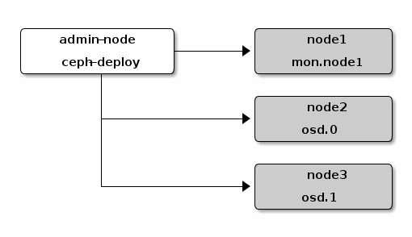

# ubuntu ceph安装以及使用

## 1.安装环境
本文主要根据官方文档使用ubuntu14.04安装ceph集群，并且简单熟悉其基本操作。整个集群包括一个admin节点（admin node,主机名为node0）和3个存储节点（主机名分别为node1，node2，node3），所有节点均安装ubuntu 14.04操作系统，除了admin节点，其余三个节点除了根磁盘，还额外配置一个磁盘作为单独的osd：

```bash
lsblk
```

输出结果：

```
NAME   MAJ:MIN RM   SIZE RO TYPE MOUNTPOINT
sr0     11:0    1   422K  0 rom
vda    253:0    0    20G  0 disk
├─vda1 253:1    0    19G  0 part /
├─vda2 253:2    0     1K  0 part
└─vda5 253:5    0  1022M  0 part [SWAP]
vdb    253:16   0    50G  0 disk
```
由于我们使用ustack的公有云申请的云主机，因此磁盘是虚拟的，根磁盘为vda，附加磁盘为vdb。
所有主机均处于`192.168.0.0/24`这个网络,ip为：

```
192.168.0.2     node0
192.168.0.5     node1
192.168.0.7     node2
192.168.0.6     node3
```
我们先设置一个mon节点，两个osd节点，后续我们再增加节点，其架构如图所示：



其中node1作为mon节点，其余node2，node3作为osd节点。

**注意：**后续操作均使用root账号，如果不使用root账号登录，需要创建一个新的账号，该账号必须具有免密码sudo权限，否则后续使用`ceph-deploy`时会失败！

## 2.安装前工作

### 1.设置admin节点root免密码登录其他节点
首先使用`ssh-keygen`生成密钥，位于`~/.ssh/id_rsa.pub`,分别拷贝`id_rsa.pub`文件到所有节点中，若没有设置root密码，可以先拷贝到管理员账号（安装操作系统时使用的用户，具有`sudo`权限）home目录，然后使用管理员账号操作：

```bash
cat id_rsa.pub | sudo tee -a /root/.ssh/authorized_keys
```
在node0节点分别测试，是否可以免密码登录其他节点：

```bash
ssh node0 uptime
ssh node1 uptime
ssh node2 uptime
ssh node3 uptime
```
结果应该不需要输入密码。

### 2.安装并行ssh命令
在admin节点安装pssh包：

```bash
apt-get install -y pssh
```

设置以下别名：

```bash
alias pssh='parallel-ssh'
alias pscp='parallel-scp'
```

创建host文件列表`hosts.txt`:

```
node0
node1
node2
node3
```

测试下pssh是否工作：

```bash
pssh -h hosts.txt uptime
```
如果全部结果都为`SUCCESS`,则说明正常工作。

### 3.使用国内镜像源
为了提高访问速度，建议修改为国内镜像源，我们使用的是阿里云镜像源:

```
root@node0:~# cat /etc/apt/sources.list
deb http://mirrors.aliyun.com/ubuntu/ trusty main restricted universe multiverse
deb http://mirrors.aliyun.com/ubuntu/ trusty-security main restricted universe multiverse
deb http://mirrors.aliyun.com/ubuntu/ trusty-updates main restricted universe multiverse
deb http://mirrors.aliyun.com/ubuntu/ trusty-proposed main restricted universe multiverse
deb http://mirrors.aliyun.com/ubuntu/ trusty-backports main restricted universe multiverse
deb-src http://mirrors.aliyun.com/ubuntu/ trusty main restricted universe multiverse
deb-src http://mirrors.aliyun.com/ubuntu/ trusty-security main restricted universe multiverse
deb-src http://mirrors.aliyun.com/ubuntu/ trusty-updates main restricted universe multiverse
deb-src http://mirrors.aliyun.com/ubuntu/ trusty-proposed main restricted universe multiverse
deb-src http://mirrors.aliyun.com/ubuntu/ trusty-backports main restricted universe multiverse
```
拷贝该文件到所有的节点：

```bash
pscp -h ~/hosts.txt /etc/apt/sources.list /etc/apt/
```

更新源：

```bash
pssh -h ~/hosts.txt 'apt-get update -y'
```

### 4.安装ceph-deploy

以下操作只需要在admin节点执行，首先需要增加ceph源：

```bash
wget -q -O- 'https://download.ceph.com/keys/release.asc' | sudo apt-key add -
echo deb http://download.ceph.com/debian-{ceph-stable-release}/ $(lsb_release -sc) main | sudo tee /etc/apt/sources.list.d/ceph.list
```
安装ceph-deploy：

```bash
sudo apt-get update && sudo apt-get install ceph-deploy
```

生产环境还需要安装ntp服务，保证集群的时钟一致，这次只是为了测试，故省略这一步。另外由于ubuntu默认防火墙是关的，SELinux也没有安装，故不需要任何操作。使用centos安装时需要打开必要端口。

## 3.开始安装ceph集群

我们使用`ceph-deploy`部署，后续操作均在admin节点操作。
首先需要创建工作环境，该环境会保存所有的配置文件：

```bash
mkdir my-cluster
cd my-cluster
```
接下分别执行以下步骤：

### 1.创建集群

```bash
ceph-deploy new node1
```
其中node1是mon节点，执行该命令会生成ceph配置文件、monitor密钥文件以及日志文件。

### 2.修改默认冗余份数

由于我们目前只有两个osd节点，而默认的冗余份数是3，因此我们需要设置为2，如果osd节点大于2，则此步骤省略。

修改`ceph.conf`文件，在`[global]`下增加以下内容：

```
osd pool default size = 2
```

### 3.配置网卡和网络

如果主机有多余一个网卡，需要设置使用的网卡和网络地址，由于我们主机只有一张网卡，此步骤省略。

### 4.开始安装ceph

```bash
ceph-deploy install node0 node1 node2 node3
```

### 5.初始化mon节点和收集密钥信息

```bash
ceph-deploy mon create-initial
```

执行完毕，目录应该有以下文件：

```
{cluster-name}.client.admin.keyring
{cluster-name}.bootstrap-osd.keyring
{cluster-name}.bootstrap-mds.keyring
{cluster-name}.bootstrap-rgw.keyring
```

完成以上步骤，安装完成，但还没有配置osd节点。

### 6.配置osd节点

首先格式化磁盘，注意我们使用的是`/dev/vdb`：

```bash
ceph-deploy disk zap node2:vdb
ceph-deploy disk zap node3:vdb
```
以上步骤会清空磁盘的所有数据。
接下来创建osd，注意由于我们只是测试，故没有使用单独的磁盘作为journal，实际在生产环境下，需要配备SSD分区作为journal，能够最大化IO吞吐量。

```
ceph-deploy osd create node2:vdb
ceph-deploy osd create node3:vdb
```

### 7.配置admin节点
admin节点同时也作为我们的client节点，需要拷贝其他节点的配置文件以及密钥，使得不需要指定mon地址以及用户信息就可以直接管理我们的ceph集群，执行以下命令即可：

```bash
ceph-deploy admin node0 node1 node2 node3
sudo chmod +r /etc/ceph/ceph.client.admin.keyring # 保证具有读取的密钥的权限
```

### 8.测试结果

运行以下命令：

```bash
ceph health
```

结果若返回`active + clean`状态，则说明部署成功！

## 4.扩展节点

增加node1也作为osd节点：

```bash
ceph-deploy disk zap node1:vdb
ceph-deploy osd create node1:vdb
ceph-deploy osd create node1:vdb
```

若需要cephFS支持，即需要提供文件系统支持，需要部署metadata server：

```bash
ceph-deploy mds create node1
```
若需要Ceph Object Gateway支持，即对象存储节点，需要部署一个RGW实例，

```bash
ceph-deploy rgw create node1
```

ceph集群至少需要一个mon节点，为了实现高可用，通常需要设置多个（一般设置为3个）mon节点，我们把node2，node3也作为mon节点：

```bash
ceph-deploy mon add node2 node3
```

当有多个mon节点时，ceph将使用quorum算法进行同步，查看状态：

```bash
ceph quorum_status --format json-pretty
```

## 5.块存储rbd使用

我们使用默认的rbd池，首先创建一个新的块设备（cinder称为volume，ceph称为image）：

```bash
rbd create foo --size 4096
```
查看刚刚创建的实例：

```bash
rbd ls
# foo
```
映射实例到虚拟设备中：

```bash
rbd map foo
# /dev/rbd1
```
创建文件系统并挂载到/mnt:

```bash
mkfs.ext4 /dev/rbd1
mount /dev/rbd1 /mnt
df -h
Filesystem     1K-blocks    Used Available Use% Mounted on
udev             1014072      12   1014060   1% /dev
tmpfs             204988     808    204180   1% /run
/dev/vda1       19478204 1936088  16529636  11% /
none                   4       0         4   0% /sys/fs/cgroup
none                5120       0      5120   0% /run/lock
none             1024932       0   1024932   0% /run/shm
none              102400       0    102400   0% /run/user
/dev/rbd1        3997376    8184   3763096   1% /mnt
```
把实例扩容到8GB：

```bash
rbd resize foo --size 8192
resize2fs /dev/rbd1
df -h
Filesystem      Size  Used Avail Use% Mounted on
udev            991M   12K  991M   1% /dev
tmpfs           201M  808K  200M   1% /run
/dev/vda1        19G  1.9G   16G  11% /
none            4.0K     0  4.0K   0% /sys/fs/cgroup
none            5.0M     0  5.0M   0% /run/lock
none           1001M     0 1001M   0% /run/shm
none            100M     0  100M   0% /run/user
/dev/rbd1       7.8G  9.0M  7.4G   1% /mnt
```
创建实例快照：

```bash
rbd snap create test@test-snap
```

## 6.分布式文件系统使用

创建一个文件系统：

```bash
ceph osd pool create cephfs_data 128
ceph osd pool create cephfs_metadata 128
ceph fs new test_fs cephfs_metadata cephfs_data
ceph fs ls
# name: test_fs, metadata pool: cephfs_metadata, data pools: [cephfs_data ]
```

创建secret文件：

```bash
cat ceph.client.admin.keyring
```
输出结果：

```bash
[client.admin]
   key = AQCj2YpRiAe6CxAA7/ETt7Hcl9IyxyYciVs47w==
```
把key值拷贝到secret文件：

```bash
echo "AQCj2YpRiAe6CxAA7/ETt7Hcl9IyxyYciVs47w==" >admin.secret
```
安装mount ceph插件：

```bash
apt-get install ceph-fs-common
```

挂载到本地文件系统`/mnt`:

```bash
sudo mount -t ceph 192.168.0.5:6789:/ /mnt -o name=admin,secretfile=admin.secret
```
其中`192.168.0.5`是node1 ip，也即mon节点ip地址。

运行`df`命令查看是否挂载成功，成功即可像本地文件系统一样操作。

### 7.对象存储

省略。。。

### 参考

http://docs.ceph.com/docs/master/
